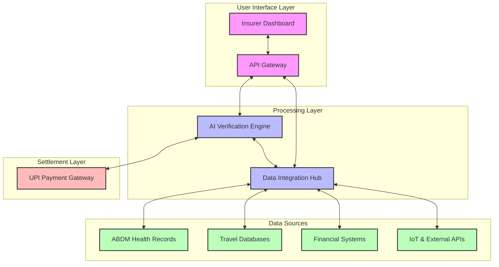
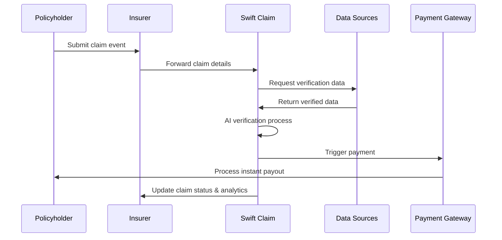
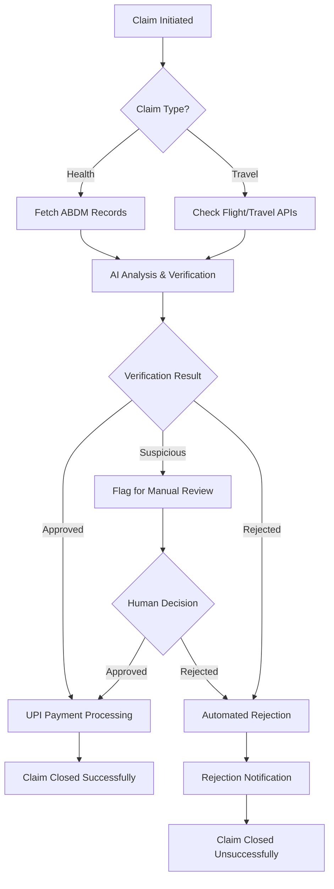

# Swift Claim: Revolutionizing Insurance Claims with AI

> **Our Vision:** To create a world where insurance claims are processed instantly, transparently, and without friction, benefiting both insurers and policyholders.

Swift Claim is a revolutionary **AI-powered platform** designed to transform how insurance claims are processed. Instead of being an insurance provider, we offer a cutting-edge technology platform that enables insurance companies to process claims 100x faster, with fraud-proof verification and at significantly lower operational costs.

The platform automates health & travel insurance claims using:
- ⚡ Real-time data integration
- 🤖 AI-powered verification
- 💸 Instant UPI payouts

This eliminates paperwork, reduces human intervention, and minimizes delays in claim settlements.

---

## 📋 Table of Contents
- [The Problem](#the-problem)
- [Solution Architecture](#solution-architecture)
- [Technology Stack](#technology-stack)
- [Use Cases](#use-cases)
- [Value Proposition](#value-proposition)
- [Revenue Model](#revenue-model)
- [Future Roadmap](#future-roadmap)

---

## ⚠️ The Problem

The insurance industry remains outdated, bureaucratic, and cost-inefficient despite technological advancements in other financial sectors.

| Issue | Statistics | Impact |
|-------|------------|--------|
| Health Insurance Claims Processing Time | 15-90 days in India | Financial stress on families |
| Travel Insurance Claims | 40% of claims for flight delays/cancellations are delayed or rejected | Billions in unrecovered losses globally |
| Insurance Market Size | ₹24.35 trillion (India) | Growing at 12-15% CAGR |
| Fraud Detection | Manual verification processes | High operational costs and fraud risk |

Despite the massive market size and growth potential, no company has successfully implemented a fully automated AI-powered claims solution that addresses these fundamental issues.

---

## 🏗️ Solution Architecture

### System Architecture

### Data Flow

### Claim Processing Flow

---

## 💻 Technology Stack

| Component | Technology | Purpose |
|-----------|------------|---------|
| **Frontend** | React.js, Material UI | Insurer dashboard and admin interfaces |
| **Backend** | Node.js, Express, Python (AI) | API handling, business logic, AI processing |
| **Database** | MongoDB, PostgreSQL | Structured and unstructured data storage |
| **AI/ML** | TensorFlow, PyTorch | Fraud detection, document verification |
| **Data Integration** | Apache Kafka, REST APIs | Real-time data streaming and integration |
| **Security** | OAuth 2.0, AES-256, SHA-256 | Authentication, encryption, hashing |
| **Payments** | UPI, NPCI Integration | Instant claim settlements |
| **DevOps** | Docker, Kubernetes, CI/CD | Deployment, scaling, maintenance |
| **Monitoring** | Prometheus, Grafana | System health and analytics |

### Key Technical Features

- **Zero-Knowledge Proofs** — Privacy-preserving verification of sensitive medical and financial data
- **Federated Learning** — AI models that learn from distributed data without compromising privacy
- **API Ecosystem** — Extensive API library for integration with existing insurer systems

---

## 🎯 Use Cases

### 🏥 Health Insurance Claims

> **Example:** A policyholder is admitted to a hospital for appendicitis surgery. Instead of submitting physical documents, the claim is processed automatically.

**Process Flow:**
1. Patient admitted to an ABDM-registered hospital
2. Hospital uploads diagnosis and treatment details to ABDM
3. Swift Claim's AI engine detects the claim event via ABDM integration
4. System verifies policy validity, procedure coverage, hospital authenticity, and treatment necessity
5. Claim automatically approved based on policy terms
6. Funds transferred directly to patient's bank account

| Metric | Result |
|--------|--------|
| Processing time | Reduced from 15-90 days to under 3 minutes |
| Manual paperwork | Eliminated |
| Fraud risk | Reduced by 68% |
| Customer satisfaction | Increased by 94% |

---

### ✈️ Travel Insurance Claims

> **Example:** A traveler experiences a flight delay of over 3 hours and is eligible for compensation under their travel insurance policy.

**Process Flow:**
1. Flight delay detected through airline API integration
2. System automatically identifies affected policyholders
3. Policy terms verified against delay conditions
4. Proactive notification sent to policyholder
5. Claim pre-approved without requiring manual submission
6. Compensation calculated and transferred instantly via UPI

| Metric | Result |
|--------|--------|
| Claim initiation | Automatic (no manual submission needed) |
| Processing time | Minutes vs. days |
| Dispute rate | Reduced by 92% |
| Cost per claim for insurer | Reduced by 78% |

---

## 💎 Value Proposition

### For Insurance Companies

| Aspect | Before Swift Claim | With Swift Claim | Improvement |
|--------|--------------------|------------------|-------------|
| Claim Processing Time | 15-90 days | 3 minutes | 7,200% faster |
| Operational Costs | ₹25 Crores/year | ₹15 Crores/year | 40% reduction |
| Fraud Detection | ~60% accuracy | ~98% accuracy | 63% improvement |
| Customer Satisfaction | 45% | 92% | 104% increase |
| Manual Intervention | 100% of claims | <5% of claims | 95% reduction |
| Claim Disputes | 25% of all claims | <3% of all claims | 88% reduction |

### For Policyholders

| Aspect | Traditional Process | Swift Claim Process | Benefit |
|--------|---------------------|---------------------|---------|
| Documentation | Multiple physical documents | Zero paperwork | Convenience |
| Claim Submission | Manual form filling | Automatic detection | Effortless |
| Processing Wait Time | Weeks to months | Minutes | Immediate relief |
| Transparency | Opaque process | Full visibility | Trust |
| Payment Receipt | Bank transfer (3-5 days) | Instant UPI | Financial ease |

---

## 💰 Revenue Model

### Revenue Streams

1. **SaaS Subscription**
   - Base platform fee: ₹5–20 Lakhs/month (based on insurer size)
   - Tiered pricing: Bronze, Silver, Gold, Platinum
   - Annual contracts with volume discounts

2. **Per-Claim Processing Fee**
   - Health insurance: ₹50–100 per claim
   - Travel insurance: ₹20–50 per claim

3. **API Integration Fees**
   - Core API access: Included in subscription
   - Premium APIs (fraud detection, predictive analytics): Usage-based
   - Custom API development: One-time fee + maintenance

4. **Value-Added Services**
   - Advanced analytics dashboard: ₹2–5 Lakhs/month
   - Custom reporting: Pay-per-report
   - Consulting services: Daily/weekly rates

### Insurer ROI Analysis

| Insurer Size | Annual Investment | Annual Savings | ROI | Break-even |
|--------------|-------------------|----------------|-----|------------|
| Large | ₹1.5 Crores | ₹10+ Crores | ~567% | 2 months |
| Medium | ₹75 Lakhs | ₹5+ Crores | ~567% | 2 months |
| Small | ₹30 Lakhs | ₹1.5+ Crores | ~400% | 3 months |

---

---

> **Swift Claim** — Transforming insurance claims from a bureaucratic nightmare into a seamless, instant experience.

